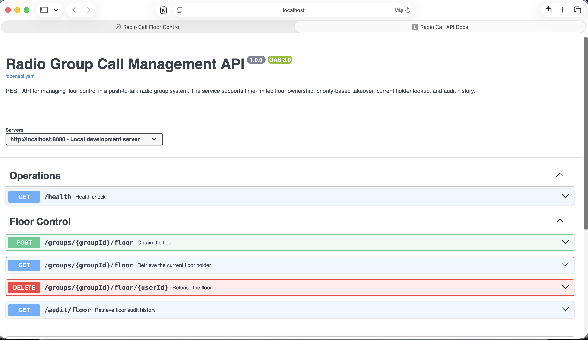
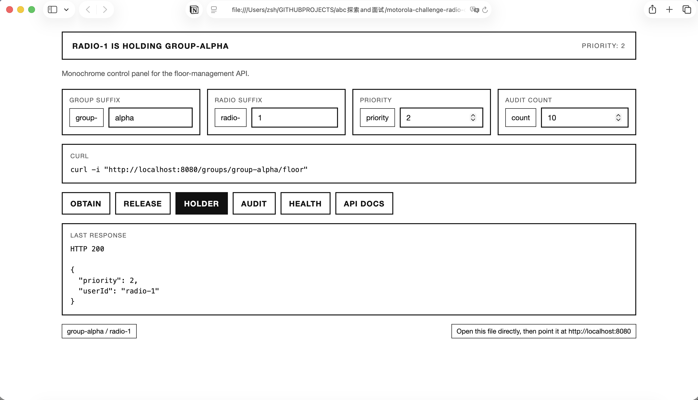

# Radio Group Call Management API

## Implemented Scope

**Core Assignment - [ finished ]**

- Obtain, renew, and release floor ownership
- Dockerized application

**Bonus Scope - [ finished ]**

- Current holder lookup
- Floor lease timeout
- Priority-based takeover
- Recent audit history
- Local Kind/Kubernetes setup
- CI quality gate with format, Credo, and tests

**Developer Convenience - [ finished ]**

- Health check endpoint
- Swagger UI and OpenAPI spec
- Standalone browser UI
- Docker Compose local runner

## Docker

Recommended local run:

```bash
docker compose up --build
```

The container exposes the same API at http://localhost:8080

Stop it with `docker compose down`.

Or build and run manually:

```bash
docker build -f dockerfile -t radio_call_api:local .
docker run --rm -p 8080:8080 radio_call_api:local
```

## Kubernetes

First-time local run with Kind:

```bash
kind create cluster --name radio-call
docker build -f dockerfile -t radio_call_api:local .
kind load docker-image radio_call_api:local --name radio-call
kubectl apply -f k8s/
kubectl rollout status deployment/radio-call-api --timeout=90s
kubectl port-forward svc/radio-call-api 8080:8080
```

Second run, if the cluster is still there:

```bash
kubectl port-forward svc/radio-call-api 8080:8080
```

Clean up:

```bash
kubectl delete -f k8s/
kind delete cluster --name radio-call
```

## Source Run

Install dependencies:

```bash
mix deps.get
```

Start the API:

```bash
mix run --no-halt
```

The API runs on: http://localhost:8080

Interactive API docs: http://localhost:8080/docs

API docs preview:



## Local Browser UI

Open it directly:

```bash
cd frontend && open index.html
```

Or serve it with `python3 -m http.server 8000 -d frontend`, then visit http://localhost:8000.

Browser UI preview:



## Quality Gate

Run the same checks used by CI:

```bash
mix check
```

This runs: `mix format --check-formatted`，`mix credo --strict`，`mix test`

## Project Layout

```text
.github/workflows/
  ci.yml                  # GitHub Actions quality gate
config/
  config.exs              # default app config
  runtime.exs             # production runtime env config
  test.exs                # test-specific config
docker-compose.yml        # local Docker Compose runner
dockerfile                # release image build
frontend/
  index.html              # standalone local UI
k8s/
  api-deployment.yaml     # local Kubernetes deployment
  api-service.yaml        # local Kubernetes service
lib/radio_call_api/
  application.ex          # supervision tree
  config.ex               # app config accessors
  floor_control/
    service.ex            # business operations
    request_parser.ex     # request validation
    store.ex              # store behaviour
    memory_store.ex       # in-memory store and timers
  http/
    router.ex             # Plug routes
    floor_controller.ex   # HTTP adapter
    response.ex           # JSON response helpers
priv/static/
  docs.html               # Swagger UI page
  openapi.yaml            # OpenAPI spec
test/
  radio_call_api/         # unit and HTTP integration tests
```
